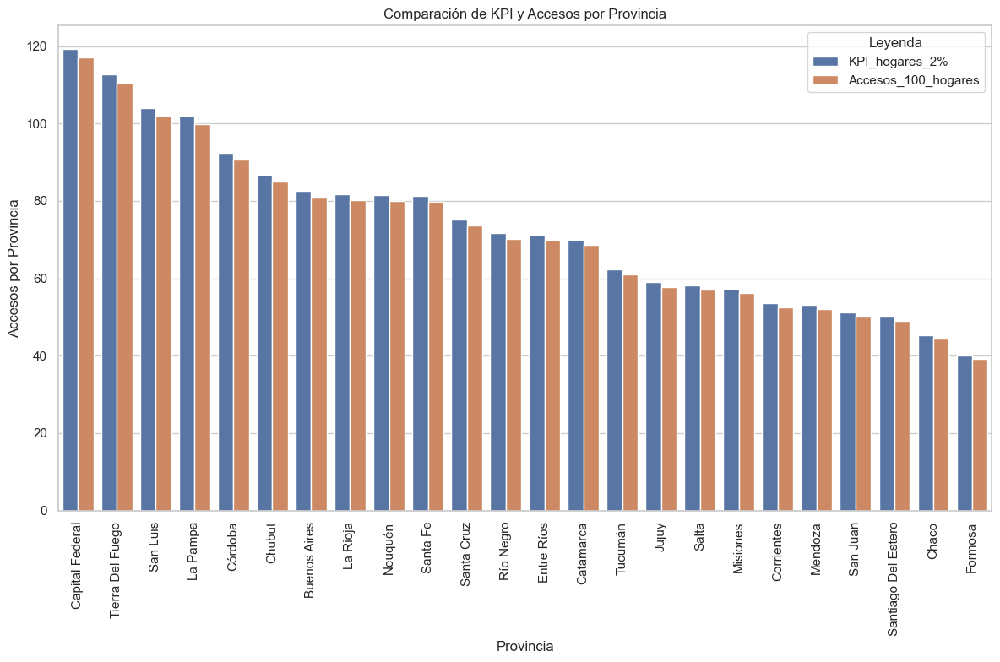
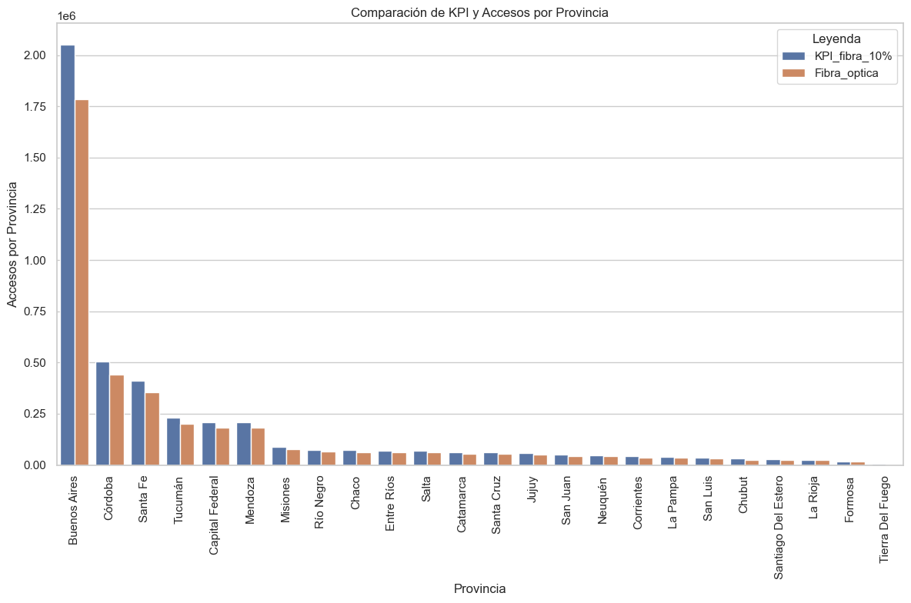
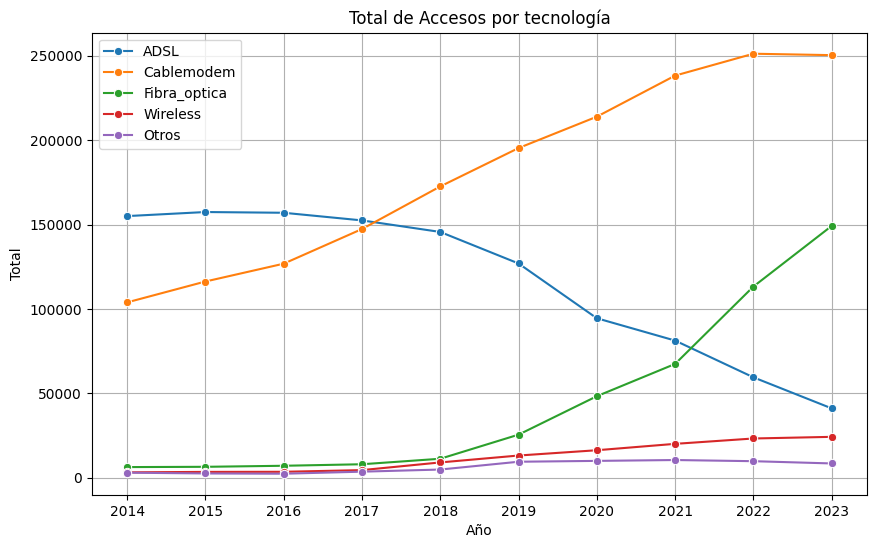
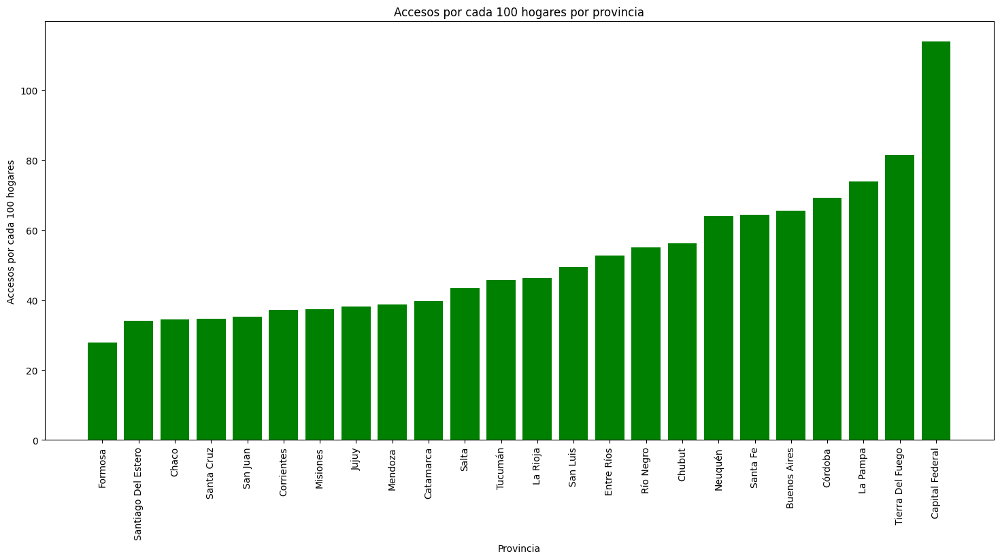

# Análisis del sector de telecomunicaciones en Argentina

Este repositorio contiene un proyecto de análisis de datos relacionados con telecomunicaciones. Se han utilizado datos obtenidos de la API de ENACOM para llevar a cabo un análisis exploratorio (EDA) y crear visualizaciones a través de Power BI.

## Estructura del Repositorio

* **Datasets**: Carpeta que contiene archivos CSV generados a partir de los datos de telecomunicaciones. Estos almacenas los datasets que usamos para todo el proyecto tanto para le ``EDA`` como para ``Power Bi``.
* **EDA**: En esta carpeta se encuentran los Notebooks de python utilizados para realizar el Análisis Exploratorio de Datos (EDA). Estos notebooks contienen el procesamiento de los dataframes obtenidos de la carpeta ``Datasets``. 
* **Dashboard**: Archivo de Power Bi que presenta visualizaciones y analisis detallados de los datos recopilados.

## Introduccion

En la última década, el análisis del desarrollo del sector de servicios de internet en Argentina ha revelado una demanda creciente tanto por parte de la sociedad como de las empresas, que buscan una conectividad más eficiente y confiable. Sin embargo, este aumento en la necesidad de acceso a la red ha venido acompañado de un panorama diversificado en todo el país, donde el crecimiento no ha sido homogéneo. Argentina, siendo un país vasto y geográficamente diverso, además de un país federal, ha enfrentado desafíos considerables para garantizar que todas las regiones tengan igualdad de acceso y calidad de servicio en un contexto de demanda en constante expansión

## Transformaciones (ETL) y Análisis exploratorio de datos (EDA)

Para todos los datasets seguí la siguiente metodología de trabajo:

1. Búsqueda de tipo de datos incorrectos:
    - Verificar que cada columna contenga el tipo de datos adecuado.
    - Convertir tipos de datos incorrectos a los tipos adecuados.

2. Búsqueda de datos faltanes: 
    - Identificar valores nulos o ausentes en el dataset.
    - Decidir cómo manejar los datos faltantes: eliminarlos o rellenarlos con valores apropiados.

3. Búsqueda de registros duplicados: 
    - Detectar filas duplicadas en el dataset.
    - Decidir si eliminar duplicados completos o basados en ciertas columnas.

4. Búsqueda de valores atípicos o outliers:
    - Identificar valores atípicos que se desvíen significativamente del resto de los datos.

5. Realizamos gráficos para analizar la información que podríamos tener.

## KPIs

Por otro lado, se propone trabajar con 2 KPI´s principales:
1. **Aumentar en un 2% el acceso al servicio de internet para el próximo trimestre, cada 100 hogares, por provincia.**
    - **Objetivo:** Se detecta que cada vez se requiere más acceso a internet por provincia por lo que aumentaremos en un 2% nuestro acceso al servicio de internet.
    - **Medición:** Evaluar el porcentaje de hogares con acceso a internet en cada provincia y comparar con el trimestre anterior.

2. **Aumentar en un 10% el accesos al servicio de internet a través de Fibra Óptica por provincia.**
    - **Objetivo** Se detecto un fuerte crecimiento con la tecnologia de fibra optica, y para darme mas impulta a esta tecnologia se aumentara su acceso un 10% mas que el ultimo trimestre.
    - **Medición:** Evaluar el porcentaje con acceso a internet por Fibra Óptica en cada provincia y compara con el trimestre anterior.
    

## Conclusiones del Proyecto

Después de realizar el Análisis Exploratorio de Datos y visualizar la información mediante Power BI, se han identificado varias conclusiones importantes:

 * **Crecimiento de la Fibra Óptica**: La fibra óptica está creciendo muy fuertemente como tecnología se puede estimar que en 2 o 3 años, si clabemoden sigue estacando o reemplazado por la fibra óptica, será la tecnología más usada para dar acceso a internet. También el ADSL es un acceso que quedo obsoletam se está eliminando su uso a partir de 2018 por otras tecnologías más eficientes como el Cablemoden o la Fibra óptica.

* **Distribución del servicio entre provincias**: Se identificaron áreas geográficas con mayor demanda de servicios de telecomunicaciones, lo que podría ser relevante para estrategias de cobertura y servicios, encabezada principalmente por `Capital Federal`.

